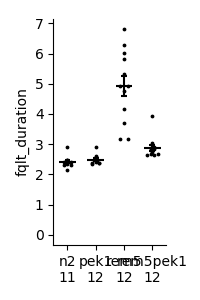

# tkmodules

## Overview

modules written by tk

## Requirement
- python3.11
- numpuy
- pandas
- matplotlib
- scipy
- statsmodels

## Installation
Setup python3 environment.

Put required file into place where you need.

## Usage

- dotplot

    Dotplot aka swarmplot/Beeswarmplot. 
    
    Median with inter quatile range are shown as bars in default.
    
    `def dotplots(_thedata, **kwargs):`

    _thedata: list of list: [[],[]...]. not numpy array. or melted form of pandas.Dataframe. if melted form, label must come first column

    **kwargs could be labels, groupnames ylim, size,thickness, binnum, coeff, sort, figsize

    ylim: (min, max)    
    
    191227 
    
    mct (measures of central tendency) = "mean" or "median"
    
    errorbar = "sd" or "se"

    

    The "sort" option tend to show "artificiala visual artifact of U-shaped dot stacks"[^dotref1], so not recommended.

[^dotref1]: [Beeswarm Boxplot (and plotting it with R)](https://www.r-statistics.com/2011/03/beeswarm-boxplot-and-plotting-it-with-r/)

<!-- 
## Note
## Features 
## Author 

## Reference
-->

## License
MPL-2.0
